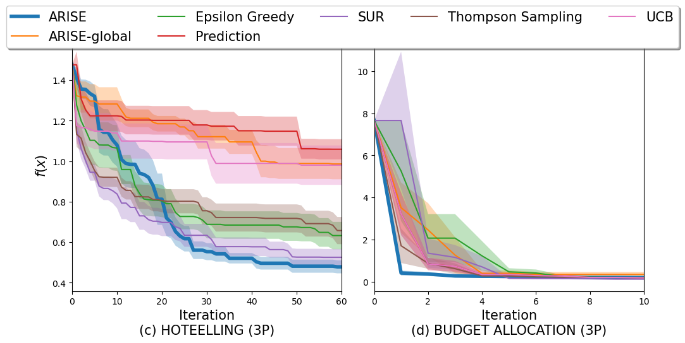

# UAI24-rebuttal

This includes the updated implementation of ARISE, and latest results on 3-player scenarios in hotelling and budget allocation games.

## 3-player results

The following figure  shows collective results on 10 independent trails on each tasks. We highlight ARISE's simple regret curve. It shows that consistent with our previous result, ARISE outperforms or at least matches the best baseline method's performance.

## Environment

The implementation has been tested on M1 Pro with 16GB RAM and macOS 14.2.1 (23C71). Using the following code to install the conda environment:

```shell
conda env create -f environment.yml
```

## Here are instructions of running the algorithm

```shell
# Generate visualization on pre-computed results 
python visualize_uai_rebuttal.py

# All algorithms (Hotelling)
python test_3_player.py --opt_steps=100 --n_repeat=10 --task=hotelling

# All algorithms (BudgetAllocation)
python test_3_player.py --opt_steps=10 --n_repeat=10 --task=BudgetAllocation --subsample
```
